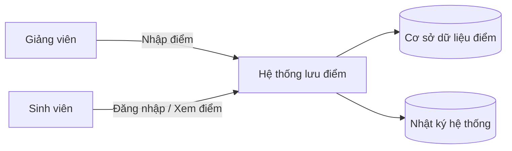

# Context Diagram (Mô tả ngữ cảnh)

## Gợi ý đọc sơ đồ## Assets
- Cơ sở dữ liệu điểm sinh viên
- Tài khoản người dùng (giảng viên, sinh viên, admin)

## CIA Mapping
- Incident A: Confidentiality
- Incident B: Integrity
- Incident C: Availability

## Incident B Analysis
- Threat: Attacker hoặc người dùng trái phép thay đổi điểm số trong hệ thống
- Vulnerability: Hệ thống phân quyền yếu, thiếu xác thực mạnh và không có cơ chế ghi log đầy đủ
- Mitigation: Áp dụng kiểm soát truy cập theo vai trò (RBAC), xác thực mạnh (MFA), và ghi log để theo dõi thay đổi

## Reflection
Qua bài lab này, em hiểu rõ hơn về mô hình CIA và cách áp dụng trong việc phân tích an toàn thông tin. Em cũng học được cách phân biệt giữa threat và vulnerability, đồng thời biết cách đề xuất biện pháp mitigation phù hợp để giảm thiểu rủi ro trong hệ thống.
- **Giảng viên** là tác nhân có quyền nhập điểm.
- **Sinh viên** là tác nhân có quyền xem điểm.
- **Hệ thống lưu điểm** là nơi xử lý đăng nhập, truy vấn và hiển thị dữ liệu.
- **Cơ sở dữ liệu điểm** lưu thông tin cần bảo vệ.
- **Nhật ký hệ thống** hỗ trợ kiểm tra, truy vết sự cố.
